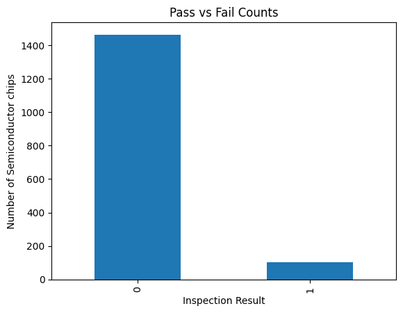
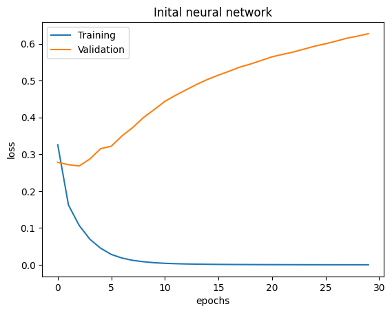
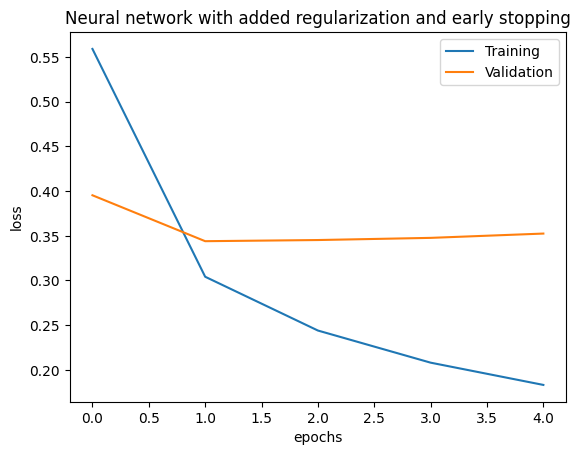

# SECOM-Fault-Prediction
Neural network based semiconductor wafer fault prediction using the SECOM manufacturing dataset, with overfitting analysis, regularization, and threshold optimization.
# Semiconductor Wafer Fault Prediction using Neural Networks

Predicting semiconductor wafer failures using manufacturing sensor data from the SECOM dataset. This project explores data preprocessing, neural networks, overfitting analysis, regularization, and threshold optimization for defect detection in semiconductor fabrication processes.

---

## Overview

Semiconductor fabrication plants collect hundreds of sensor measurements during wafer manufacturing. Defects are often detected only after expensive final testing. The objective of this project is to predict whether a wafer will pass or fail final testing using manufacturing sensor data.

This project uses the SECOM manufacturing dataset and develops machine learning models to identify defective wafers before final testing.

---

## Problem Statement

Given hundreds of sensor readings collected during semiconductor manufacturing, predict whether a wafer will:

- Pass final testing (0)
- Fail final testing (1)

Early identification of defective wafers can reduce manufacturing costs and improve production efficiency.

---

## Dataset

**Dataset:** SECOM Manufacturing Dataset

### Dataset Characteristics

| Property | Value |
|-----------|---------|
| Samples | 1567 |
| Features | ~590 Sensor Measurements |
| Target | Pass / Fail |
| Missing Values | Present |
| Class Distribution | Highly Imbalanced |

### Target Labels

| Label | Meaning |
|---------|---------|
| 0 | Pass |
| 1 | Fail |

---

## Data Preprocessing

The following preprocessing steps were performed:

- Removed features with excessive missing values
- Replaced remaining missing values using median imputation
- Applied feature scaling using StandardScaler
- Split data into training and testing sets

---

## Models Implemented

### 1. Logistic Regression

Used as a baseline model for comparison.

### 2. Initial Neural Network

Architecture:

```text
Input Features
      ↓
Dense(128, ReLU)
      ↓
Dense(64, ReLU)
      ↓
Dense(1, Sigmoid)
```

### Observation

The model achieved high overall accuracy but performed poorly on defective-wafer detection and showed signs of overfitting.

---

### 3. Improved Neural Network

Architecture:

```text
Input Features
      ↓
Dense(32, ReLU)
      ↓
Dense(16, ReLU)
      ↓
Dense(1, Sigmoid)
```

Improvements:

- L2 Regularization
- Early Stopping

These techniques were used to reduce overfitting and improve generalization.

---

## Class Distribution



The dataset is highly imbalanced, with significantly more passing wafers than failing wafers.

---

## Initial Neural Network (Before Regularization)



### Observation

Training loss decreased rapidly toward zero while validation loss increased steadily.

This indicates severe overfitting, where the model memorized the training data but failed to generalize to unseen examples.

---

## Regularized Neural Network



### Observation

L2 regularization and early stopping reduced overfitting and improved generalization performance.

---

## Model Comparison

| Model | Accuracy | Precision (Fail) | Recall (Fail) | F1-Score (Fail) |
| :--- | :--- | :--- | :--- | :--- |
| **Logistic Regression (Baseline)** | `0.84` | `0.11` | `0.19` | `0.14` |
| **Initial Neural Network (Unregularized)** | `0.92` | `0.17` | `0.05` | `0.07` |
| **Improved Neural Network (Threshold = 0.05)** | `0.43` | `0.09` | **`0.81`** | **`0.16`** |

### Key Observation
Although the initial unregularized neural network achieved a high overall accuracy score (`0.92`), it was completely blind to real-world faults, capturing a microscopic **5%** of actual failures. By implementing deep regularization and shifting our decision boundary to **0.05**, we intentionally traded off global accuracy to secure a powerful **81% defect detection rate (Recall)**, delivering a far safer and more cost-effective model for manufacturing environments.
This demonstrates that accuracy alone can be misleading when working with highly imbalanced datasets.

---

## Threshold Optimization

The default classification threshold of 0.5 resulted in poor failure detection.

A threshold sweep was performed to analyze the precision-recall tradeoff.

| Threshold | Precision (Fail) | Recall (Fail) | F1-Score (Fail) | Operational Impact |
| :--- | :--- | :--- | :--- | :--- |
| **0.05** | `0.09` | **`0.81`** | **`0.16`** | 🎯 **Selected Point:** Catches 17/21 defects. Highly protective. |
| **0.10** | `0.08` | `0.38` | `0.14` | Misses more than half of the defective wafers. |
| **0.15** | `0.11` | `0.24` | `0.15` | Poor coverage; lets 16 defects slip through. |
| **0.20** | `0.10` | `0.10` | `0.10` | ❌ **Dangerous:** Completely blind to 90% of faults. |
| **0.25** | `0.17` | `0.10` | `0.12` | Ineffective; model cannot clear this boundary. |

### Selected Threshold

**Threshold = 0.05** For the final deployment, **0.05** was selected as the optimal operational threshold. At this setting, the model achieves its highest failure-class F1-score (`0.16`) and a powerful **Recall of `0.81`**, successfully flagging 17 out of the 21 actual defective wafers in the test set. 

In a semiconductor fabrication environment, the financial penalty of letting a broken wafer sneak past quality control is incredibly high. Setting the threshold to `0.05` prioritizes strict defect containment, ensuring high manufacturing safety while minimizing expensive customer Escapes.
## Key Findings

- Semiconductor manufacturing data contains many missing values and highly imbalanced labels.
- Accuracy alone is not a reliable metric for evaluating defect-detection systems.
- Neural networks can overfit small industrial datasets.
- L2 regularization and early stopping improved model generalization.
- Threshold tuning significantly improved defective-wafer detection performance.

---

## Technologies Used

- Python
- NumPy
- Pandas
- Matplotlib
- Scikit-Learn
- TensorFlow / Keras
- Jupyter Notebook

---

## Repository Structure

```text
SECOM-Fault-Prediction/

README.md
requirements.txt
Semiconductor_Wafer_Fault_Prediction.ipynb

images/
├── class_distribution.png
├── nn_before_fix.png
└── nn_after_fix.png
```

---

## How to Run

1. Clone the repository

```bash
git clone <repository-url>
```

2. Install dependencies

```bash
pip install -r requirements.txt
```

3. Open Jupyter Notebook

```bash
jupyter notebook
```

4. Run:

```text
Semiconductor_Wafer_Fault_Prediction.ipynb
```

---

## Future Improvements

Potential future work includes:

- Feature selection techniques
- Random Forests and Gradient Boosting
- More advanced neural network architectures
- Explainable AI methods for identifying important manufacturing sensors

---

## Author

**Radhakrishna G**  
Engineering Physics  
Indian Institute of Technology Madras
